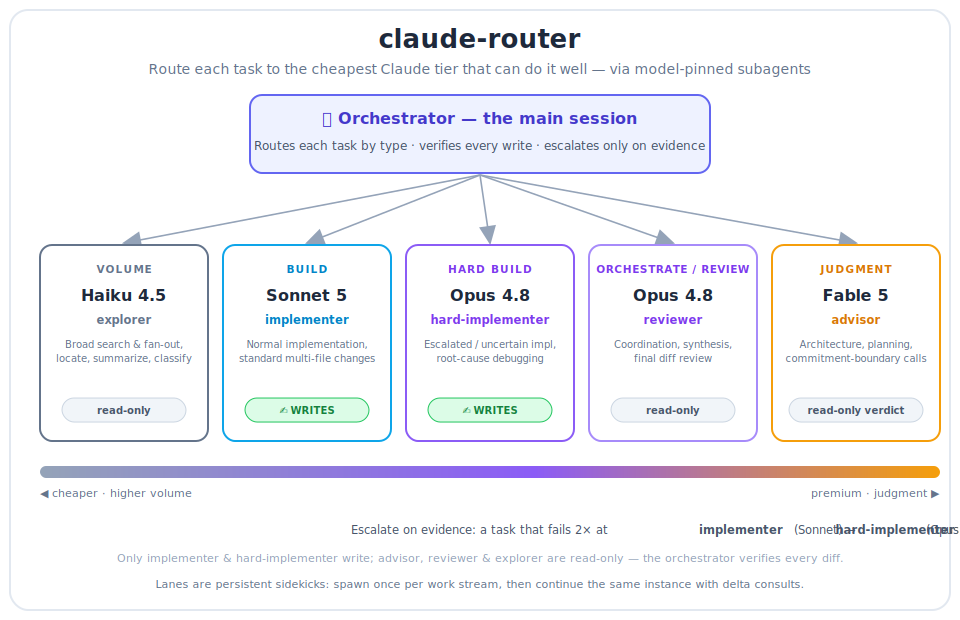

# claude-router

> **Route each task to the cheapest Claude model tier that can do it well.**
> A [Claude Code](https://claude.com/claude-code) skill that dispatches work across model-pinned subagents — spend premium intelligence only where errors compound, run everything else at workhorse rates.




---

## Why

Most turns in a session are mechanical — searching, drafting, standard edits. A few moments decide whether the next hour is wasted: an architecture call, a risky diff, a fork in the approach. Paying a premium model for *everything* is waste; paying a cheap model for the moments that matter is worse. So route by task type:

> **Cheap models for volume. Premium models where a mistake compounds.**

You approach top-tier quality while the bulk of tokens generate at workhorse rates.

## How it works

- **Model-pinned subagents.** Each lane is a subagent with its model fixed at spawn time — a subagent left to inherit the orchestrator's reasoning is a wasted or overspent dispatch. Dispatch a named lane, or make an inline `Agent` call with an explicit `model:` override.
- **Persistent sidekicks, not per-call tools.** Spawn a lane once per work stream, then continue the *same instance* with delta messages so its context stays warm — a fresh spawn per consult re-pays the full context transfer and remembers nothing.
- **Read-only vs write lanes.** `advisor`, `explorer`, and `reviewer` judge, search, and synthesize; only `implementer` and `hard-implementer` write — and the orchestrator verifies every diff.
- **Escalate on evidence.** A task that fails at `implementer` (Sonnet) twice escalates with its failure log — to `hard-implementer` (Opus) if the code itself is hard, or to an `advisor` (Fable) consult if the blocker is a design decision. Never a blind third retry.

## Tiers

| Tier        | Model     | Task class                                                        | Lane agent          | Writes? |
| ----------- | --------- | ---------------------------------------------------------------- | ------------------- | ------- |
| Judgment    | Fable 5   | Deep architecture, planning, commitment-boundary advice          | `advisor`           | no |
| Orchestrate / Review | Opus 4.8 | Coordination, complex reasoning, synthesis, diff review | main session / `reviewer` | no |
| Hard build  | Opus 4.8  | Escalated / uncertain implementation, root-cause debugging       | `hard-implementer`  | **yes** |
| Build       | Sonnet 5  | Normal implementation, standard multi-file changes               | `implementer`       | **yes** |
| Volume      | Haiku 4.5 | Broad search / exploration fan-out, locate code, summarize       | `explorer`          | no |

## The lane agents

The skill routes by dispatching **named subagents** — one per lane. Each lives in [`agents/`](agents/) as a self-contained definition with its model pinned in the frontmatter, so a dispatch runs at the right tier regardless of the orchestrator's current model. They are the other half of the skill: without them, a dispatch-by-name has nothing to spawn.

| Agent file | Lane | Model | Writes? |
| ---------- | ---- | ----- | ------- |
| [`advisor.md`](agents/advisor.md) | Judgment | Fable 5 | no |
| [`reviewer.md`](agents/reviewer.md) | Review / synthesis | Opus 4.8 | no |
| [`hard-implementer.md`](agents/hard-implementer.md) | Hard build | Opus 4.8 | **yes** |
| [`implementer.md`](agents/implementer.md) | Build | Sonnet 5 | **yes** |
| [`explorer.md`](agents/explorer.md) | Volume search | Haiku 4.5 | no |

Edit an agent's `model:` to match your own model access, or its body to tune the lane's conduct rules. Keep the `name:` in sync with what `SKILL.md` and `ROUTING.md` dispatch.

## Install

The skill and its lane agents install into two directories. Drop the skill into your skills directory, the agents into your agents directory, and the routing file at your config root:

```bash
# 1 · the skill
mkdir -p ~/.claude/skills/claude-router
cp SKILL.md ~/.claude/skills/claude-router/SKILL.md

# 2 · the lane agents the skill dispatches (required)
mkdir -p ~/.claude/agents
cp agents/*.md ~/.claude/agents/

# 3 · the routing policy
cp ROUTING.md ~/.claude/CLAUDE-ROUTING.md   # then edit to taste
```

Skipping step 2 leaves the skill dispatching `advisor`/`implementer`/… by name into agents that don't exist. Project-scoped installs put both under `<repo>/.claude/` instead. A per-repo `<repo>/CLAUDE-ROUTING.md` overrides the global one wholesale. Full contract in [`SKILL.md`](SKILL.md); the dispatch table lives in [`ROUTING.md`](ROUTING.md).

## Examples — how routing plays out

Same orchestrator, different lane per task.

### 1 · Normal feature build
**You:** "Add the pagination params to the list endpoint."
**Router:** standard multi-file change, no hard reasoning → `implementer` (Sonnet) with a scoped task + test command. The orchestrator verifies the diff.

### 2 · A gnarly bug or deep refactor
**You:** "This race condition only repros under load — figure out why and fix it."
**Router:** the code itself is the hard part → `hard-implementer` (Opus). It proves the root cause before touching anything; the orchestrator re-runs to confirm.

### 3 · "Where is X used across the codebase?"
**You:** "Find every place we read the legacy `user.role` field."
**Router:** broad, read-heavy sweep → `explorer` (Haiku) fan-out. You keep its conclusions, not the file dumps — cheap tokens for volume work.

### 4 · A fork in the approach
**You:** "Should we put this on the queue or call it inline?"
**Router:** a commitment-boundary decision where a wrong call compounds → `advisor` (Fable), read-only, with the decision + constraints. Its verdict is relayed verbatim, then acted on.

### 5 · Review a risky diff before merge
**You:** "Sanity-check this auth change before I push."
**Router:** → `reviewer` (Opus), read-only on the diff. Findings come back; the orchestrator decides.

### 6 · Automatic escalation
A `implementer` (Sonnet) packet fails its checks twice → the router escalates with the failure log: to `hard-implementer` (Opus) if the code is the blocker, or `advisor` (Fable) if the spec is ambiguous. The ladder is capped — never a blind third attempt at the same tier.

## Design principles

- **Pin the model at spawn.** Never let a subagent inherit the orchestrator's reasoning level — it's the difference between a cheap sweep and an expensive one.
- **Verify every write.** A read-only verdict is not done work; only `implementer` / `hard-implementer` change files, and the orchestrator checks the diff.
- **Degrade, don't drop.** If a tier's model is unavailable, fall back to the nearest tier and *tell the user the tier changed* — never silently route a judgment call to a weaker model.
- **Batch the premium lane.** Consult `advisor` at genuine commitment boundaries; don't spray it at routine turns.

## Notes

- Tune the tiers and budgets in [`ROUTING.md`](ROUTING.md) to your own model access.

## License

[MIT](LICENSE) © Vimox Shah
